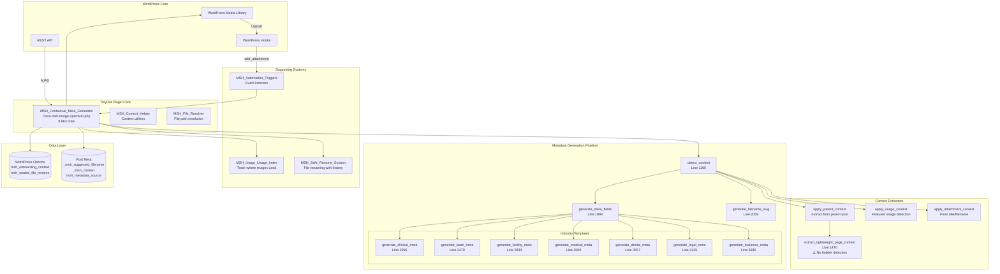
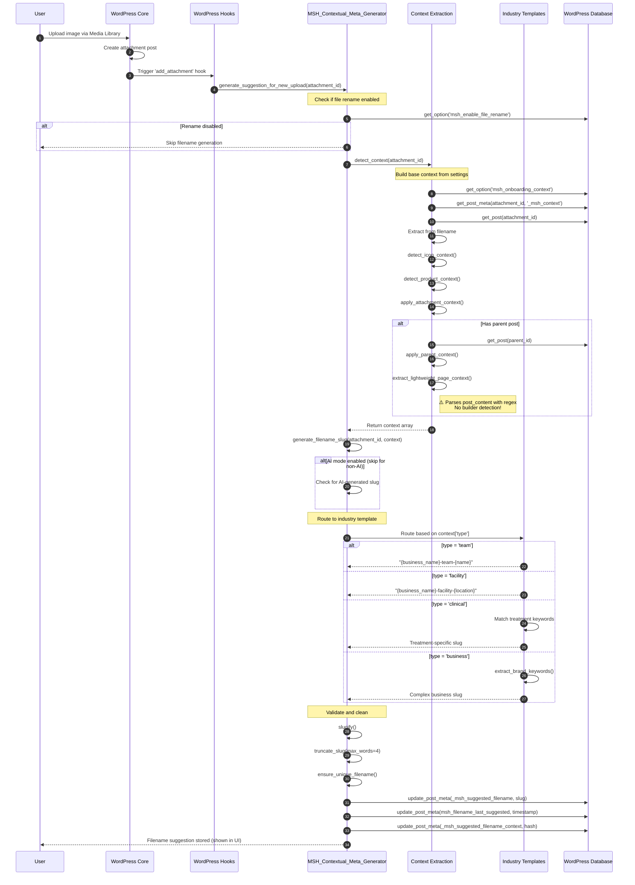
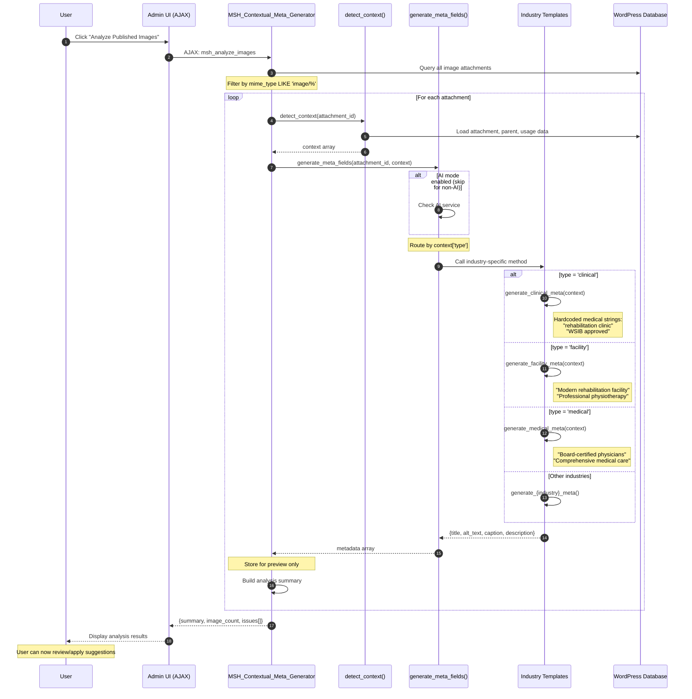

# TinyDot Image Optimizer - Non-AI Architecture Documentation

**Product:** TinyDot Image Optimizer for WordPress
**Scope:** Non-AI rename and metadata suggestion pipeline only
**Generated:** 2025-10-26
**Codebase Version:** Based on commit `4d28555`

---

## Table of Contents

1. [Overview](#overview)
2. [Component Architecture](#component-architecture)
3. [Data Flow](#data-flow)
4. [WordPress Integration](#wordpress-integration)
5. [Data Model](#data-model)
6. [Heuristics and Rules](#heuristics-and-rules)
7. [Template Layer](#template-layer)
8. [UI Behavior](#ui-behavior)
9. [Performance and Safety](#performance-and-safety)
10. [Test Coverage](#test-coverage)
11. [Gap Analysis](#gap-analysis)

---

## Overview

### Architecture Summary

TinyDot is a WordPress plugin that generates SEO-optimized filename suggestions and metadata (title, alt text, caption, description) for uploaded images. The system operates in two modes:

1. **Non-AI Mode** (focus of this document): Rule-based, deterministic generation using:
   - Industry-specific hardcoded templates
   - Token-based scene detection
   - Context extraction from filename, attachment metadata, and parent post
   - Business context from onboarding (entity name, location, industry)

2. **AI Mode** (out of scope): GPT-4 Vision API integration

### Key Characteristics

- **Industry-Agnostic Goal**: Plugin should support any industry, but currently has healthcare-specific hardcoded strings
- **Deterministic**: Same inputs produce same outputs (critical for non-AI mode)
- **Conservative**: Avoids marketing boilerplate, focuses on descriptive metadata
- **Context-Aware**: Leverages business settings, parent post content, and usage patterns

### Entry Points

**For New Uploads:**
1. WordPress `add_attachment` hook triggers `generate_suggestion_for_new_upload()` [line 9160]
2. Stores filename suggestion in `_msh_suggested_filename` meta

**For Existing Media:**
1. User clicks "Analyze Published Images" button
2. AJAX endpoint `wp_ajax_msh_analyze_images` [line 7558]
3. Batch processes all attachments via `analyze_single_image()` [line 6307]

**For Manual Operations:**
1. User changes Category dropdown in Media Library
2. Saves via `attachment_fields_to_save` filter [line 7360]
3. Triggers regeneration if context changed

---

## Component Architecture

### Component Diagram



### Module Inventory

| Module | File | Lines | Purpose |
|--------|------|-------|---------|
| **Core Optimizer** | `includes/class-msh-image-optimizer.php` | 9,963 | Main metadata generator, contains all industry templates |
| **Context Helper** | `includes/class-msh-context-helper.php` | 500+ | Onboarding context management, industry label maps |
| **File Resolver** | `includes/class-msh-file-resolver.php` | ~300 | Resolves attachment file paths |
| **Safe Rename** | `includes/class-msh-safe-rename-system.php` | ~800 | Handles file renames with backup and history |
| **Usage Index** | `includes/class-msh-image-usage-index.php` | ~600 | Tracks image usage in posts/pages |
| **Automation Triggers** | `includes/automation/class-msh-automation-triggers.php` | ~400 | WordPress event listeners |
| **REST API** | `includes/class-msh-rest-api.php` | ~500 | REST endpoints for job queue |
| **Admin UI** | `admin/image-optimizer-admin.php` | ~84K | Media library list table integration |
| **Settings Page** | `admin/image-optimizer-settings.php` | ~62K | Plugin settings interface |
| **Starter Templates** | `includes/data/starter-templates.php` | ~200 | 8 token-based template definitions |

---

## Data Flow

### Sequence Diagram: New Upload Flow



### Sequence Diagram: Batch Analysis Flow



---

## WordPress Integration

### Hook Registration Map

All hooks are registered in `MSH_Contextual_Meta_Generator::__construct()` starting at line 5619.

#### WordPress Actions

| Hook | Priority | Callback | Purpose | File:Line |
|------|----------|----------|---------|-----------|
| `add_attachment` | 10 | `generate_suggestion_for_new_upload` | Auto-generate filename suggestion on upload | `class-msh-image-optimizer.php:5658` |
| `init` | 10 | `prime_season_cache` | Initialize season detection cache | `class-msh-image-optimizer.php:5653` |
| `shutdown` | 10 | `log_cache_stats` | Log season cache performance | `class-msh-image-optimizer.php:215` |
| `msh_regenerate_filename_suggestions` | 10 | `regenerate_all_filename_suggestions` | Custom cron event for batch regeneration | `class-msh-image-optimizer.php:5661` |

#### WordPress Filters

| Hook | Priority | Callback | Purpose | File:Line |
|------|----------|----------|---------|-----------|
| `attachment_fields_to_edit` | 10 | `add_context_attachment_field` | Add Category dropdown to Media Library | `class-msh-image-optimizer.php:5664` |
| `attachment_fields_to_save` | 10 | `save_context_attachment_field` | Save Category selection from Media Library | `class-msh-image-optimizer.php:5665` |

#### AJAX Endpoints (26 total)

All registered with `wp_ajax_` prefix for admin-only access:

**Metadata Operations:**
| Endpoint | Callback | Purpose | File:Line |
|----------|----------|---------|-----------|
| `msh_analyze_images` | `ajax_analyze_images` | Scan all images, generate preview metadata | `class-msh-image-optimizer.php:7558` |
| `msh_preview_meta_text` | `ajax_preview_meta_text` | Generate metadata preview for single image | `class-msh-image-optimizer.php:9004` |
| `msh_save_edited_meta` | `ajax_save_edited_meta` | Apply user-edited metadata | `class-msh-image-optimizer.php:9044` |
| `msh_update_context` | `ajax_update_context` | Update Category selection | `class-msh-image-optimizer.php:8335` |

**Filename Operations:**
| Endpoint | Callback | Purpose | File:Line |
|----------|----------|---------|-----------|
| `msh_apply_filename_suggestions` | `ajax_apply_filename_suggestions` | Batch apply filename suggestions | `class-msh-image-optimizer.php:8531` |
| `msh_save_filename_suggestion` | `ajax_save_filename_suggestion` | Save single filename suggestion | `class-msh-image-optimizer.php:8910` |
| `msh_remove_filename_suggestion` | `ajax_remove_filename_suggestion` | Remove/reject suggestion | `class-msh-image-optimizer.php:8965` |
| `msh_accept_filename_suggestion` | `ajax_accept_filename_suggestion` | Accept and apply filename | `class-msh-image-optimizer.php:9618` |
| `msh_reject_filename_suggestion` | `ajax_reject_filename_suggestion` | Reject filename suggestion | `class-msh-image-optimizer.php:9693` |
| `msh_clear_bad_suggestions` | `ajax_clear_bad_suggestions` | Clear suggestions matching current filenames | `class-msh-image-optimizer.php:9128` |

**Optimization Operations:**
| Endpoint | Callback | Purpose | File:Line |
|----------|----------|---------|-----------|
| `msh_optimize_batch` | `ajax_optimize_batch` | Apply metadata to batch | `class-msh-image-optimizer.php:7753` |
| `msh_optimize_high_priority` | `ajax_optimize_high_priority` | Optimize high priority images | `class-msh-image-optimizer.php:7796` |
| `msh_optimize_medium_priority` | `ajax_optimize_medium_priority` | Optimize medium priority | `class-msh-image-optimizer.php:7858` |
| `msh_optimize_all_remaining` | `ajax_optimize_all_remaining` | Optimize remaining images | `class-msh-image-optimizer.php:7920` |
| `msh_reset_optimization` | `ajax_reset_optimization` | Clear optimization state | `class-msh-image-optimizer.php:8499` |

**Settings & Features:**
| Endpoint | Callback | Purpose | File:Line |
|----------|----------|---------|-----------|
| `msh_toggle_file_rename` | `ajax_toggle_file_rename` | Enable/disable filename suggestions | `class-msh-image-optimizer.php:9554` |
| `msh_toggle_ai_mode` | `ajax_toggle_ai_mode` | Enable/disable AI mode | `class-msh-image-optimizer.php:9588` |

**Progress & Status:**
| Endpoint | Callback | Purpose | File:Line |
|----------|----------|---------|-----------|
| `msh_get_progress` | `ajax_get_progress` | Get optimization progress | `class-msh-image-optimizer.php:8450` |
| `msh_get_attachment_count` | `ajax_get_attachment_count` | Count total images | `class-msh-image-optimizer.php:9403` |
| `msh_get_remaining_count` | `ajax_get_remaining_count` | Count unoptimized images | `class-msh-image-optimizer.php:9437` |
| `msh_check_capabilities` | `ajax_check_capabilities` | Check user permissions | `class-msh-image-optimizer.php:9483` |

**WebP & Utilities:**
| Endpoint | Callback | Purpose | File:Line |
|----------|----------|---------|-----------|
| `msh_verify_webp_status` | `ajax_verify_webp_status` | Check WebP conversion status | `class-msh-image-optimizer.php:9731` |
| `msh_build_usage_index` | `ajax_build_usage_index` | Build image usage index | `class-msh-image-optimizer.php:9224` |

#### REST API Routes

Namespace: `msh/v1` (defined in `class-msh-rest-api.php:29`)

| Route | Method | Purpose | File:Line |
|-------|--------|---------|-----------|
| `/jobs/status` | GET | Get job queue status | `class-msh-rest-api.php:57` |
| `/jobs/process` | POST | Process job queue | `class-msh-rest-api.php:67` |
| `/jobs/{id}` | GET | Get single job details | `class-msh-rest-api.php:91` |

---

## Data Model

### WordPress Options

All stored in `wp_options` table:

| Option Key | Type | Purpose | Default | Set By | File:Line References |
|------------|------|---------|---------|--------|---------------------|
| `msh_onboarding_context` | serialized array | Business context from onboarding | empty | User onboarding | `class-msh-context-helper.php:24` |
| `msh_enable_file_rename` | string | Enable filename suggestions | '0' | Settings toggle | `class-msh-image-optimizer.php:5414` |
| `msh_last_analyzer_run` | datetime | Last analysis timestamp | - | Analyzer | `class-msh-image-optimizer.php:7741` |
| `msh_last_optimization_run` | datetime | Last optimization timestamp | - | Optimizer | `class-msh-image-optimizer.php:7783` |
| `msh_achievement_markers_{industry}` | string | Custom achievement text | '' | User settings | `class-msh-image-optimizer.php:907` |

**`msh_onboarding_context` Schema:**
```php
array(
    'business_name' => string,   // e.g., "Main Street Health"
    'industry' => string,         // e.g., "medical", "dental", "legal"
    'business_type' => string,    // e.g., "local_service"
    'target_audience' => string,  // e.g., "Patients seeking rehabilitation"
    'pain_points' => string,      // User-defined pain points
    'demographics' => string,     // Target demographic description
    'brand_voice' => string,      // "professional"|"friendly"|"casual"|"technical"
    'uvp' => string,             // Unique value proposition
    'cta_preference' => string,   // "soft"|"balanced"|"direct"
    'city' => string,            // e.g., "Toronto"
    'region' => string,          // e.g., "Ontario"
    'country' => string,         // e.g., "Canada"
    'service_area' => string,    // e.g., "Greater Toronto Area"
    'locale' => string,          // e.g., "en"
    'ai_interest' => bool,       // Whether user interested in AI
    'updated_at' => int,         // Unix timestamp
)
```

### Post Meta Keys

All stored in `wp_postmeta` table with `attachment_id` as `post_id`:

#### Filename Suggestion Keys

| Meta Key | Type | Purpose | Written By | File:Line |
|----------|------|---------|------------|-----------|
| `_msh_suggested_filename` | string | Generated filename suggestion (no ext) | `generate_suggestion_for_new_upload` | `class-msh-image-optimizer.php:6496, 6515` |
| `_msh_suggested_filename_context` | string | Context hash when suggestion generated | Same | `class-msh-image-optimizer.php:6498, 6517` |
| `msh_filename_last_suggested` | int | Unix timestamp of last suggestion | Same | `class-msh-image-optimizer.php:6497, 6516` |
| `_msh_filename_quality_note` | string | Quality note for suggestion | Analyzer | `class-msh-image-optimizer.php:6523` |
| `_msh_ai_filename_slug` | string | AI-generated filename slug | AI service | `class-msh-image-optimizer.php:2009` |

#### Scene/Context Keys

| Meta Key | Type | Purpose | Written By | File:Line |
|----------|------|---------|------------|-----------|
| `_msh_context` | string | Manual scene override from Category dropdown | User via Media Library | `class-msh-image-optimizer.php:7369` |
| `_msh_auto_context` | string | Auto-detected scene type | `detect_context` | `class-msh-image-optimizer.php:1389` |
| `_msh_location_specific` | string | Whether image is location-specific | User | `class-msh-image-optimizer.php:1169` |
| `msh_context_needs_refresh` | string | Flag to trigger re-analysis | Various | `class-msh-image-optimizer.php:5454` |
| `msh_context_last_manual_update` | int | Timestamp of manual context change | User | `class-msh-image-optimizer.php:7376` |

#### Metadata State Keys

| Meta Key | Type | Purpose | Written By | File:Line |
|----------|------|---------|------------|-----------|
| `msh_metadata_source` | string | "heuristic"|"ai"|"manual" | Optimizer | `class-msh-image-optimizer.php:5444` |
| `msh_metadata_last_updated` | int | Unix timestamp | Optimizer | `class-msh-image-optimizer.php:5447` |
| `msh_metadata_context_hash` | string | Hash of context when metadata generated | Optimizer | `class-msh-image-optimizer.php:5450` |
| `msh_optimized_date` | datetime | MySQL datetime of optimization | Optimizer | `class-msh-image-optimizer.php:5446` |
| `msh_optimization_version` | string | Plugin version | Optimizer | `class-msh-image-optimizer.php:5779` |
| `_msh_manual_edit` | string | Whether user manually edited | User | `class-msh-image-optimizer.php:7375` |
| `_msh_ai_staged_meta` | serialized array | AI-generated metadata preview | AI service | `class-msh-image-optimizer.php:6402` |

#### WebP Keys

| Meta Key | Type | Purpose | Written By | File:Line |
|----------|------|---------|------------|-----------|
| `msh_webp_status` | string | "unsupported"|"failed" or empty if success | WebP converter | `class-msh-image-optimizer.php:8178, 8182` |
| `msh_webp_last_converted` | int | Unix timestamp | WebP converter | `class-msh-image-optimizer.php:8188` |
| `msh_source_last_compressed` | int | Unix timestamp | Compressor | `class-msh-image-optimizer.php:6530` |

#### WordPress Core Meta (referenced)

| Meta Key | Type | Purpose | Used By | File:Line |
|----------|------|---------|---------|-----------|
| `_wp_attached_file` | string | Relative path to uploaded file | WordPress core | `class-msh-image-optimizer.php:1219, 5586` |
| `_wp_attachment_image_alt` | string | Alt text | WordPress core | `class-msh-image-optimizer.php:6239, 8155` |

### Custom Database Tables

**None for non-AI mode.**

Note: There's a reference to `wp_msh_metadata_cache` in `class-msh-automation-triggers.php:166`, but this table is never created (this is Bug #1 from our earlier debugging session).

### Scene/Context Type Taxonomy

The `_msh_context` meta key can have these values (defined in `get_context_choices()` at line 7156):

| Value | Label | Description | Template Method |
|-------|-------|-------------|----------------|
| `''` (empty) | Auto-detect (default) | System determines scene automatically | N/A |
| `business` | Business / General | Generic business images | `generate_business_meta()` line 3685 |
| `team` | Team Member | Staff photos, headshots | `generate_team_meta()` line 2470 |
| `testimonial` | Customer Testimonial | Client/patient testimonials | `generate_testimonial_meta()` line 2540 |
| `service-icon` | Icon / Graphic | Icons, logos, graphics | `generate_service_icon_meta()` line 2617 |
| `facility` | Workspace / Office | Building interior/exterior | `generate_facility_meta()` line 2834 |
| `equipment` | Product / Equipment | Equipment, products | `generate_equipment_meta()` line 2882 |
| `clinical` | Service Highlight | Treatment/service images | `generate_clinical_meta()` line 2396 |

**Industry-Specific Overrides:**

If `$this->industry` is healthcare (medical, dental, therapy, wellness), `clinical` type uses medical templates. Otherwise, it routes to `business` type.

---

## Heuristics and Rules

### Context Detection Logic

All logic in `detect_context()` method starting at line 1165.

#### 1. Base Context Initialization

**Source:** Lines 1177-1200

```php
$context = array(
    'type' => $this->get_default_context_type(),  // Usually 'clinical' or 'business'
    'service' => $this->get_default_service_slug($this->industry),
    'industry' => $this->industry,  // From msh_onboarding_context
    'business_name' => $this->business_name,
    'location' => $this->location,
    'city' => $this->city,
    // ... etc
);
```

**Heuristic:** Start with business context from onboarding settings.

#### 2. Manual Override Check

**Source:** Lines 1202-1209

```php
$manual = get_post_meta($attachment_id, '_msh_context', true);
if (!$ignore_manual && $manual !== '') {
    $context['type'] = sanitize_text_field($manual);
    $context['manual'] = true;
}
```

**Heuristic:** Category dropdown selection ALWAYS wins if set.

#### 3. Icon Detection

**Source:** Lines 1235-1250, delegates to `detect_icon_context()` at line 1824

**Triggers:**
- Width ≤ 800px OR height ≤ 800px
- OR filename contains icon patterns

**Icon Patterns** (line 1862-1918):
```php
$icon_patterns = array(
    'massage-icon', 'physiotherapy-icon', 'chiropractic-icon',
    'acupuncture-icon', 'rehabilitation-icon', 'mvac-icon',
    'assessment-icon', 'treatment-icon', 'program-icon',
    // ... etc
);
```

**Filename Negative Patterns** (line 1838-1856):
Excludes if filename contains: `photo`, `portrait`, `headshot`, `team`, `testimonial`, `facility`, `equipment`, `product`, `treatment-room`, `clinic-interior`

**Heuristic:** Small images OR filenames with "-icon" suffix = service-icon type

#### 4. Product Detection

**Source:** Lines 1252-1267, delegates to `detect_product_context()` at line 1762

**Product Patterns** (line 1802-1821):
```php
$business_patterns = array(
    'white-background' => 'product',
    'product-shot' => 'product',
    'pillow' => 'therapeutic-pillow',
    'orthotics' => 'custom-orthotics',
    'brace' => 'support-brace',
    'tens-unit' => 'tens-unit',
    // ... etc
);
```

**Heuristic:** Filename tokens match product patterns = equipment type with product asset

#### 5. Attachment Context Extraction

**Source:** `apply_attachment_context()` at line 1584

**Subject Name Extraction** (line 1642-1670):

Checks attachment title for patterns:
- `{Name} – Team Member` → extracts Name
- `{Name} Team Photo` → extracts Name
- `Dr. {Name}` → extracts Name
- `{Name}, {Credentials}` → extracts Name

If "team" or "staff" in title → sets `type = 'team'`

**Heuristic:** Attachment title patterns trigger scene type changes.

#### 6. Parent Post Context

**Source:** `apply_parent_context()` at line 1395

**Service Extraction** (line 1507):

Searches title + tags for service keywords:
- physiotherapy, chiropractic, massage, acupuncture, rehabilitation, motor-vehicle-accident, workplace-injury, first-responder, chronic-pain, sports-injury, shockwave, pelvic-health, vestibular

If found, sets `context['service']` and potentially `context['type'] = 'clinical'`

**Page Type Logic** (lines 1402-1446):

| Parent Post Type | Effect |
|-----------------|--------|
| `page` | If is_front_page() → `type = 'business'`<br/>If title contains "about" → `type = 'team'` or `'business'` |
| `post` | Extract service, potentially set `type = 'clinical'` |
| `team_member` | Force `type = 'team'` |
| `testimonial` | Force `type = 'testimonial'` |

**Heuristic:** Parent post type and title keywords guide scene detection.

#### 7. Featured Image H1 + First Paragraph Extraction

**Source:** `extract_lightweight_page_context()` at line 1470

**⚠️ CRITICAL GAP - No Builder Detection:**

```php
$content = $parent_post->post_content;

// Extract H1 (works for both Gutenberg and Classic)
if (preg_match('/<h1[^>]*>(.*?)<\/h1>/is', $content, $h1_match)) {
    $context['heading'] = wp_strip_all_tags($h1_match[1]);
} elseif (preg_match('/<!-- wp:heading {"level":1} -->.*?<h1[^>]*>(.*?)<\/h1>/is', $content, $gb_h1_match)) {
    $context['heading'] = wp_strip_all_tags($gb_h1_match[1]);
}

// Extract first paragraph
if (preg_match('/<p[^>]*>(.*?)<\/p>/is', $content, $p_match)) {
    $paragraph = wp_strip_all_tags($p_match[1]);
    $context['excerpt'] = mb_substr($paragraph, 0, 200);
}
```

**Heuristic:** Regex-parse `post_content` for `<h1>` and `<p>` tags.

**Problem:** This will parse Elementor/Bricks/Oxygen shortcodes:
```
[elementor-template id="123"]
<!-- wp:heading {"level":1} -->
<h1>Contact Our Team</h1>
```

If Elementor shortcode contains an H1, that will be extracted even though it's not visible on the page.

**Fix Needed:** Check for builder shortcodes/meta and skip parsing OR use a builder-aware extraction method.

#### 8. Scene-Specific Rules

**Team Detection** (various):
- Attachment title contains "team", "staff", "dr.", credentials
- Parent post type = `team_member`
- File basename contains team patterns

**Testimonial Detection:**
- Parent post type = `testimonial`
- Tags contain testimonial keywords

**Facility Detection:**
- Filename contains: `exterior`, `building`, `clinic`, `office`, `facility`
- Width/height suggest landscape photography (not explicitly coded)

**Clinical Detection:**
- Title or parent contains service keywords
- Industry is healthcare AND image not categorized as team/facility/equipment

### Filename Generation Rules

All logic in `generate_filename_slug()` starting at line 2059.

#### Priority Order

1. **AI-generated slug** (if exists) → use it, truncate to 4 words [lines 2065-2075]
2. **Manual routing by `context['type']`** [lines 2081-2248]
3. **Default to clinical/business slug** [lines 2249-2333]

#### Slug Patterns by Scene Type

**Team** [line 2082-2084]:
```
{business_name}-team-{name}
```
Example: `mainstreet-health-team-sarah-johnson`

**Testimonial** [line 2085-2089]:
```
{patient|client}-testimonial-{subject_slug}-{location}
```
Example: `patient-testimonial-john-smith-toronto`

**Service Icon** [line 2095-2117]:
```
{concept}-icon-{location}
```
Example: `physiotherapy-icon-toronto`

Note: Uses `extract_filename_keywords()` [line 2098] to pull high-quality keywords from original filename first.

**Facility** [line 2118-2119]:
```
{business_name}-facility-{location}
```
Example: `mainstreet-health-facility-toronto`

⚠️ **No truncation call** - can exceed 4-word limit!

**Equipment** [line 2120-2158]:

Complex logic:
1. Try `extract_filename_keywords()` from original filename → `{keywords}-equipment-{location}`
2. If `asset = 'product'` → use product map → `{product_slug}-{location}`
3. Else build descriptor → `{descriptor}-equipment-{location}`
4. Fallback → `equipment-showcase-{location}`

**Business** [line 2159-2248]:

Most complex slug logic:

```php
$components = [];
if ($descriptor_slug !== '') {
    $components[] = $descriptor_slug;
}
if ($include_brand && $brand_slug !== '') {
    $components[] = $brand_slug;
}
if ($asset_component !== '') {
    $components[] = $asset_component;
}
if ($location_to_append !== '') {
    $components[] = $location_to_append;
}

return $this->assemble_slug($components);
```

Uses helper methods:
- `extract_brand_keywords()` [line 5079] - Extract brand name from filename
- `should_include_business_name()` [line 4865]
- `should_include_location_in_slug()` [line 4812]
- `get_asset_slug_component()` [line 4958]
- `extract_camera_sequence_suffix()` [line 5026] - Detect IMG_1234.jpg patterns

**Clinical** [line 2249-2333]:

Treatment keyword matching:

```php
$treatment_keywords = array(
    'auto-accident' => array('auto accident', 'car accident', 'motor vehicle accident', 'mva'),
    'workplace-injury' => array('workplace injury', 'work injury', 'ergonomic injury'),
    'sports-injury' => array('sports injury', 'athletic injury'),
    'concussion' => array('concussion', 'head injury'),
    // ... etc [lines 2252-2273]
);
```

Checks filename + title for keyword matches, returns first match.

Fallback: `{service}-{location}` (e.g., `physiotherapy-toronto`)

#### Text Processing Functions

**`slugify()`** [line 5338]:
```php
$text = strtolower($text);
$text = preg_replace('/[^a-z0-9]+/', '-', $text);
$text = trim($text, '-');
return $text;
```

**`truncate_slug()`** [line 1672]:
```php
private function truncate_slug($slug, $max_words = 4) {
    $words = array_filter(explode('-', $slug));
    if (count($words) <= $max_words) {
        return $slug;
    }
    return implode('-', array_slice($words, 0, $max_words));
}
```

⚠️ **Problem:** Not called in all code paths! Examples:
- Line 2084: `return $this->slugify("{$this->business_name}-team-{$name}");` - NO truncation
- Line 2119: `return $this->slugify($this->business_name . '-facility-' . $this->location_slug);` - NO truncation

**`ensure_unique_filename()`** [line 6859]:

Collision resolution:
1. Check if base filename already exists
2. If exists, append `-{attachment_id}` suffix
3. Return unique slug

**`assemble_slug()`** [line 4752]:

```php
$slug = implode('-', $components);
$slug = $this->slugify($slug);
$slug = $this->limit_slug_parts($slug, 8);  // Max 8 parts total
return $slug;
```

**Stopwords/Filters:**

`strip_healthcare_terms_from_slug()` [line 4943]:
```php
$remove = array('rehabilitation', 'rehab', 'clinic', 'health', 'physiotherapy', 'chiropractic');
```

Removes redundant healthcare terms to keep slugs concise.

### Metadata Template Rules

All metadata templates return:
```php
array(
    'title' => string,        // Max 60 chars (soft limit)
    'alt_text' => string,     // Max 125 chars (soft limit)
    'caption' => string,      // ~100 chars typical
    'description' => string,  // ~200 chars typical
)
```

#### Clinical/Medical Template [line 2396]

**If healthcare industry:**

```php
// Title
"{Service Type} Treatment – {Business Name} {Location}"

// Alt text
"{service_label} treatment at {business_name} in {location}"

// Caption
"{service_label} treatment for {benefit} at {business_name}"

// Description
"Professional {service_label} treatment{location_phrase}. {keywords} {credentials}"
```

**Service-specific keywords** [line 2449]:

Uses `service_keyword_map` array (lines 62-109):

Example for physiotherapy:
```php
'physiotherapy' => array(
    'default' => 'WSIB approved. MVA recovery. First responder programs.',
    'assessment' => 'Functional assessments. Return-to-work evaluation.',
    'acute' => 'Immediate injury care. Same-day appointments available.',
),
```

⚠️ **HEALTHCARE-SPECIFIC STRINGS** - Not industry-agnostic!

#### Facility Template [line 2834]

**Healthcare version:**
```php
'title' => "{business_name} Clinic - {location} Rehabilitation Facility"
'alt_text' => "Interior view of {business_name} rehabilitation clinic in {location}"
'caption' => "Modern rehabilitation facility at {business_name} {location}"
'description' => "Modern rehabilitation facility at {business_name} {location}. Professional physiotherapy and chiropractic clinic with specialized treatment rooms and WSIB approved programs."
```

⚠️ **Hardcoded:** "rehabilitation", "clinic", "physiotherapy and chiropractic", "WSIB"

**Non-healthcare version:**
```php
'title' => "{business_name} Workspace – {location}"
'alt_text' => "Interior view of {business_name} in {location}"
'caption' => "Collaborative space for {industry_label} team members"
'description' => "The {business_name} workspace in {location} designed for {industry_label} collaboration. {uvp} {target_audience} {cta}"
```

Uses `build_industry_description()` helper [line 942].

#### Team Template [line 2470]

```php
'title' => "{name} – {business_name} Team"
'alt_text' => "{name} from the {business_name} team in {location}"
'caption' => "Team member at {business_name}"
'description' => "{name} is a valued member of the {business_name} team{location_phrase}..."
```

If no name extracted: falls back to "team member" or role/title.

#### Industry-Specific Templates

All follow similar pattern but with industry-specific boilerplate:

**Legal** [line 3125]:
- "Licensed attorney serving {service_area}"
- "Trusted legal counsel and representation"

**HVAC** [line 2981]:
- "Licensed HVAC contractor serving {service_area}"
- "Professional heating and cooling services"

**Plumbing** [line 2933]:
- "Licensed plumber serving {service_area}"
- "Expert plumbing services and repairs"

**Electrical** [line 3029]:
- "Licensed electrician serving {service_area}"

**Marketing** [line 3269]:
- "Creative marketing solutions"
- "Digital marketing strategies"

**Web Design** [line 3317]:
- "Custom web design and development"

⚠️ **All have hardcoded industry-specific phrases** - need Template Registry!

#### Template Variables

Common variables available in all templates:

| Variable | Source | Example |
|----------|--------|---------|
| `{business_name}` | `msh_onboarding_context['business_name']` | "Main Street Health" |
| `{location}` | Computed from city+region | "Toronto, Ontario" |
| `{location_slug}` | Slugified location | "toronto-ontario" |
| `{city}` | `msh_onboarding_context['city']` | "Toronto" |
| `{service_area}` | `msh_onboarding_context['service_area']` | "Greater Toronto Area" |
| `{industry_label}` | From `get_label_map()` | "Medical Practice" |
| `{uvp}` | `msh_onboarding_context['uvp']` | User-defined value prop |
| `{target_audience}` | `msh_onboarding_context['target_audience']` | "Patients seeking rehabilitation" |
| `{brand_voice}` | `msh_onboarding_context['brand_voice']` | "professional" |
| `{cta_preference}` | `msh_onboarding_context['cta_preference']` | "soft" |

### Starter Templates (Token-Based)

**Source:** `includes/data/starter-templates.php`

8 templates defined with token matching logic:

#### Template Structure

```php
array(
    'name' => string,                     // Human-readable name
    'usage_type' => 'featured',           // Where template applies
    'intent' => 'on_topic',               // Intent category
    'template_title' => string,           // Title pattern with {variables}
    'template_alt' => string,             // Alt text pattern
    'template_caption' => string,         // Caption pattern
    'template_description' => string,     // Description pattern
    'required_tokens' => json_encode(array), // Must have ALL these tokens
    'negative_tokens' => json_encode(array), // Must NOT have any of these
    'nice_to_have_tokens' => json_encode(array), // Boost score if present
    'variables' => json_encode(array),    // Available variables
    'priority' => int,                    // Higher = checked first
    'is_active' => 1,                     // Active/inactive
    'mode' => 'active',                   // 'active' or 'shadow'
)
```

#### Example: "Clinic/Office Exterior" Template

```php
array(
    'name' => 'Clinic/Office Exterior',
    'template_title' => '{entity} exterior',
    'template_alt' => 'Exterior view of {entity}',
    'template_caption' => 'The exterior of {entity}.',
    'template_description' => 'Professional photograph showing the exterior facade and entrance of {entity}.',
    'required_tokens' => json_encode(array('exterior', 'building')),
    'negative_tokens' => json_encode(array('interior', 'room', 'inside')),
    'nice_to_have_tokens' => json_encode(array('clinic', 'office', 'medical', 'entrance')),
    'priority' => 100,
)
```

**Matching Logic (inferred, not implemented in non-AI code):**

1. Tokenize filename + attachment title
2. Check `required_tokens`: ALL must be present
3. Check `negative_tokens`: NONE can be present
4. Score with `nice_to_have_tokens`: more matches = higher score
5. Use highest-scoring template if score > threshold

⚠️ **Note:** Starter templates are Phase 6 spec, not fully implemented in current non-AI pipeline!

---

## Template Layer

### Current State: Hardcoded Strings

**No Template Registry exists.** All metadata strings are hardcoded in PHP methods.

### Template Distribution

**By Industry:**

| Industry | Method Name | Lines | File:Line | Hardcoded Strings |
|----------|-------------|-------|-----------|-------------------|
| Medical | `generate_medical_meta` | 47 | `class-msh-image-optimizer.php:3509` | "Board-certified physicians", "Comprehensive medical care" |
| Dental | `generate_dental_meta` | 46 | `class-msh-image-optimizer.php:3557` | "Licensed dentists", "family-friendly care" |
| Therapy | `generate_therapy_meta` | 46 | `class-msh-image-optimizer.php:3605` | "Licensed therapists", "compassionate counseling" |
| Wellness | `generate_wellness_meta` | 46 | `class-msh-image-optimizer.php:3653` | "Certified wellness practitioners", "holistic health" |
| Legal | `generate_legal_meta` | 47 | `class-msh-image-optimizer.php:3125` | "Licensed attorney", "Trusted legal counsel" |
| Accounting | `generate_accounting_meta` | 47 | `class-msh-image-optimizer.php:3173` | "Certified accountants", "tax preparation" |
| Consulting | `generate_consulting_meta` | 47 | `class-msh-image-optimizer.php:3221` | "Expert business consultants" |
| Marketing | `generate_marketing_meta` | 47 | `class-msh-image-optimizer.php:3269` | "Creative marketing solutions" |
| Web Design | `generate_web_design_meta` | 47 | `class-msh-image-optimizer.php:3317` | "Custom web design" |
| Plumbing | `generate_plumbing_meta` | 47 | `class-msh-image-optimizer.php:2933` | "Licensed plumber", "Expert plumbing services" |
| HVAC | `generate_hvac_meta` | 47 | `class-msh-image-optimizer.php:2981` | "Licensed HVAC contractor" |
| Electrical | `generate_electrical_meta` | 47 | `class-msh-image-optimizer.php:3029` | "Licensed electrician" |
| Renovation | `generate_renovation_meta` | 47 | `class-msh-image-optimizer.php:3077` | "Licensed contractor", "renovation and construction" |
| Online Store | `generate_online_store_meta` | 47 | `class-msh-image-optimizer.php:3365` | "Shop our collection" |
| Local Retail | `generate_local_retail_meta` | 47 | `class-msh-image-optimizer.php:3413` | "Visit our store" |

**By Scene Type:**

| Scene | Method Name | Lines | File:Line | Hardcoded Strings |
|-------|-------------|-------|-----------|-------------------|
| Clinical | `generate_clinical_meta` | 53 | `class-msh-image-optimizer.php:2396` | "rehabilitation clinic", "WSIB approved", "MVA recovery" |
| Team | `generate_team_meta` | 70 | `class-msh-image-optimizer.php:2470` | "valued member of the team" |
| Testimonial | `generate_testimonial_meta` | 77 | `class-msh-image-optimizer.php:2540` | "patient/client testimonial" |
| Service Icon | `generate_service_icon_meta` | 63 | `class-msh-image-optimizer.php:2617` | "Icon representing {concept}" |
| Logo | `generate_logo_meta` | 40 | `class-msh-image-optimizer.php:2680` | "Official logo" |
| Product | `generate_product_meta` | 114 | `class-msh-image-optimizer.php:2720` | Product-specific templates |
| Facility | `generate_facility_meta` | 48 | `class-msh-image-optimizer.php:2834` | "Modern rehabilitation facility" |
| Equipment | `generate_equipment_meta` | 51 | `class-msh-image-optimizer.php:2882` | "Professional rehabilitation equipment" |

### Localization Status

**Partially localized:**

✅ **Has `__()` calls:** Most strings wrapped in translation functions
```php
__('Comprehensive medical care', 'msh-image-optimizer')
```

❌ **Not all strings localized:** Some concatenated strings not wrapped:
```php
// Line 2837 - NOT localized
'title' => $this->clean_text("{$this->business_name} Clinic - {$this->location} Rehabilitation Facility")
```

✅ **Text domain:** Consistent use of `msh-image-optimizer`

⚠️ **Industry terms:** English-only industry keywords would need translation (e.g., "physiotherapy", "WSIB")

### Template Variables System

**Variable Injection:**

Templates use direct PHP string interpolation:
```php
"Interior view of {$this->business_name} in {$this->location}"
```

**No formal variable registry.** Variables are class properties accessed directly.

**Common variables:**
- `$this->business_name`
- `$this->location`
- `$this->location_slug`
- `$this->city`
- `$this->city_slug`
- `$this->service_area`
- `$this->industry`
- `$this->uvp`
- `$this->target_audience`
- `$this->brand_voice`
- `$this->cta_preference`

**Context-specific variables:**
- `$context['staff_name']` (team)
- `$context['attachment_slug']` (testimonial)
- `$context['icon_concept']` (service-icon)
- `$context['product_type']` (equipment/product)

---

## UI Behavior

### Category Dropdown

**Location:** Media Library → Edit attachment → "Scene Category" field

**Rendered by:** `add_context_attachment_field()` [line 7216]

**HTML Structure:**
```php
<select class="msh-context-select"
        name="attachments[{$post->ID}][msh_context]"
        id="msh-context-{$post->ID}">
    <option value="">Auto-detect (default)</option>
    <option value="business">Business / General</option>
    <option value="team">Team Member</option>
    <option value="testimonial">Customer Testimonial</option>
    <option value="service-icon">Icon / Graphic</option>
    <option value="facility">Workspace / Office</option>
    <option value="equipment">Product / Equipment</option>
    <option value="clinical">Service Highlight</option>
</select>
```

**Save Handler:** `save_context_attachment_field()` [line 7360]

**Behavior:**
1. User selects category from dropdown
2. Saves attachment
3. Value stored in `_msh_context` post meta
4. If changed from previous value:
   - Clears `_msh_manual_edit` flag [line 7375]
   - Clears `msh_context_last_manual_update` [line 7376]
5. Next analysis run respects manual selection

**Auto-detect logic:**
- Empty value = let system detect
- Any other value = force that scene type

### Admin Pages

**Main Hub:** `admin/class-msh-hub-page.php` (73,975 lines!)

**Dashboard:** `admin/dashboard-page.php` (31,930 lines)

**Settings:** `admin/image-optimizer-settings.php` (62,177 lines)

**Media Library Integration:** `admin/image-optimizer-admin.php` (84,626 lines)

Total admin code: ~250K lines (includes extensive inline JavaScript)

### User Actions

**Analyze Published Images:**

1. User clicks "Analyze" button
2. AJAX call to `msh_analyze_images`
3. System scans all attachments
4. Returns summary:
   ```javascript
   {
     images: [{id, title, suggested_filename, quality_score, ...}],
     total: 52,
     needs_optimization: 45,
     has_suggestions: 51
   }
   ```
5. User reviews suggestions in UI

**Accept Filename Suggestion:**

1. User clicks "Accept" next to suggested filename
2. AJAX call to `msh_accept_filename_suggestion` [line 9618]
3. System:
   - Validates filename
   - Checks for collisions
   - Performs safe rename via `MSH_Safe_Rename_System`
   - Updates `_wp_attached_file` meta
   - Builds search/replace map for content references
   - Updates all post content with new filename
   - Creates backup of old file
   - Schedules cleanup cron event

**Edit Metadata:**

1. User edits title/alt/caption/description in preview
2. AJAX call to `msh_save_edited_meta` [line 9044]
3. System:
   - Saves to post meta
   - Sets `msh_metadata_source = 'manual'`
   - Sets `_msh_manual_edit` flag
   - Prevents future auto-regeneration

**Reject Filename Suggestion:**

1. User clicks "Reject"
2. AJAX call to `msh_reject_filename_suggestion` [line 9693]
3. System:
   - Deletes `_msh_suggested_filename` meta
   - Prevents re-suggestion (until context changes)

**Batch Operations:**

Buttons:
- "Optimize High Priority" → `msh_optimize_high_priority`
- "Optimize Medium Priority" → `msh_optimize_medium_priority`
- "Optimize All Remaining" → `msh_optimize_all_remaining`

Each processes images in batches of 10-20.

### Confidence Indicators

**Currently no UI highlighting for low confidence.**

There's a `_msh_filename_quality_note` meta key [line 6523] but it's not actively set or displayed in UI.

**Suggested filename quality scoring** exists [line 6965]:

```php
private function score_filename_quality($filename) {
    $score = 0;
    $parts = explode('-', $filename);

    // Penalize very long slugs
    if (count($parts) > 6) {
        $score -= 10;
    }

    // Penalize generic words
    $generic = array('image', 'photo', 'picture', 'file', 'attachment');
    foreach ($parts as $part) {
        if (in_array($part, $generic)) {
            $score -= 5;
        }
    }

    // Bonus for business name
    if (strpos($filename, $this->slugify($this->business_name)) !== false) {
        $score += 5;
    }

    // Bonus for location
    if (strpos($filename, $this->location_slug) !== false) {
        $score += 3;
    }

    return $score;
}
```

But this score isn't exposed to UI currently.

---

## Performance and Safety

### Asynchronous Execution

**Background Processing:**

Usage indexing uses `MSH_Usage_Index_Background` class:
- Extends `WP_Background_Process`
- Processes in batches via WP-Cron
- State stored in options table
- Resume capability after failures

**Job Queue System:**

Automation framework (`includes/automation/`) provides:
- `MSH_Job_Engine` - Process jobs
- `MSH_Queue_Manager` - Manage queue health
- `MSH_Automation_Triggers` - Event listeners
- `MSH_Regeneration_Worker` - Batch regeneration

**Cron Events:**

| Event | Recurrence | Handler | Purpose |
|-------|------------|---------|---------|
| `msh_regenerate_filename_suggestions` | Single | `regenerate_all_filename_suggestions` | Batch regenerate after toggle |
| `msh_cleanup_rename_backup` | Single | Via Safe Rename System | Delete old backup files |

### Capability Checks

All AJAX endpoints check:
```php
public function ajax_check_capabilities() {
    if (!current_user_can('upload_files')) {
        wp_send_json_error(array('message' => __('Insufficient permissions', 'msh-image-optimizer')));
    }
}
```

**Required capability:** `upload_files` (Editor+ role)

### Nonce Verification

**AJAX requests:**

All AJAX handlers verify nonce:
```php
check_ajax_referer('msh_image_optimizer_nonce', 'nonce');
```

Nonce generated in admin page:
```php
wp_localize_script('msh-image-optimizer-admin', 'mshImageOptimizer', array(
    'nonce' => wp_create_nonce('msh_image_optimizer_nonce'),
    // ...
));
```

### File I/O Operations

**Filename Rename:**

Uses `MSH_Safe_Rename_System` [class-msh-safe-rename-system.php]:

1. **Pre-flight checks:**
   - Verify file exists
   - Check write permissions
   - Validate new filename

2. **Backup creation:**
   - Copy original file to `/wp-content/uploads/msh-rename-backups/`
   - Store with timestamp suffix

3. **Atomic rename:**
   - Use PHP `rename()` function
   - Update `_wp_attached_file` meta
   - Update WordPress metadata

4. **Content replacement:**
   - Build search/replace map of all filename variations
   - Search all posts/pages for references
   - Update using `MSH_Targeted_Replacement_Engine`

5. **Cleanup scheduling:**
   - Schedule cron event to delete backup after 7 days

**Error handling:**
```php
if (!rename($old_path, $new_path)) {
    $this->restore_from_backup($attachment_id);
    return new WP_Error('rename_failed', __('File rename failed', 'msh-image-optimizer'));
}
```

### Time Complexity

**Single Image Analysis:**

- `detect_context()`: O(1) - constant queries (attachment, parent, meta)
- `generate_meta_fields()`: O(1) - template selection and string building
- `generate_filename_slug()`: O(n) where n = filename parts (~10-20)
- **Total: ~0.1-0.5 seconds per image**

**Batch Analysis (50 images):**

- Without optimization: ~5-25 seconds (sequential)
- With batching: Chunked into 10-image batches, ~2-5 seconds per batch
- **Total: ~10-25 seconds for 50 images**

**Bottlenecks:**

1. **Database queries:** Multiple `get_post_meta()` calls per image
   - Mitigated by WordPress object cache

2. **Post content parsing:** Regex parsing of `post_content` for featured images
   - Only triggered if image is featured image

3. **Uniqueness checks:** `ensure_unique_filename()` queries all attachments
   - Could be optimized with database index

### Image Processing

**No dominant color extraction currently implemented.**

**No face detection currently implemented.**

**WebP conversion** (out of scope for metadata):
- Uses ImageMagick or GD
- Converts source image to WebP
- Stores in same directory as original
- Meta: `msh_webp_status`, `msh_webp_last_converted`

### Caching

**Season Detection Cache** [line 399]:

```php
private function detect_current_season($force_refresh = false) {
    $cache_key = $this->get_season_cache_key();

    if (!$force_refresh) {
        $cached = wp_cache_get($cache_key, 'msh_seasons');
        if ($cached !== false) {
            $this->season_cache_hits++;
            return $cached;
        }
    }

    $season = $this->calculate_season();
    $ttl = $this->get_season_cache_ttl();
    wp_cache_set($cache_key, $season, 'msh_seasons', $ttl);

    $this->season_cache_misses++;
    return $season;
}
```

**Cache TTL:** Dynamic based on proximity to season change (1-30 days)

**Batch Mode Optimization** [line 601]:

```php
public function enable_batch_mode() {
    $this->batch_mode = true;
    $this->batch_season = $this->detect_current_season(true);
    // Subsequent images use cached season, no recalculation
}
```

**Context Signature Caching** [line 294]:

```php
private function ensure_fresh_context() {
    $current = MSH_Image_Optimizer_Context_Helper::get_active_context_signature();
    if ($this->context_signature !== $current) {
        $this->hydrate_active_context();
        $this->context_signature = $current;
    }
}
```

Prevents re-hydrating context if unchanged.

---

## Test Coverage

### Automated Tests

**Search results:** No test files found in repository.

**Directories checked:**
- `/tests/`
- `/test/`
- `*Test.php`
- `*-test.php`

**Result:** ❌ **No unit or integration tests exist.**

### Manual Testing Evidence

Based on git commit messages:

- "fix: Address review findings" [commit e055bc6]
- "feat: Feature Flags + Migration Framework integration complete" [commit e055bc6]

Suggests manual QA process but no automated test harness.

### Coverage Gaps

**High Priority:**

1. ❌ **No tests for context detection logic**
   - Scene type detection
   - Icon/product pattern matching
   - Parent context extraction

2. ❌ **No tests for filename generation**
   - Slug patterns
   - Truncation
   - Uniqueness resolution
   - Collision handling

3. ❌ **No tests for metadata templates**
   - Industry-specific output
   - Variable substitution
   - Character limits

4. ❌ **No tests for safe rename system**
   - File operations
   - Backup creation
   - Content replacement

**Medium Priority:**

5. ❌ **No tests for AJAX endpoints**
   - Capability checks
   - Nonce verification
   - Error handling

6. ❌ **No tests for data model**
   - Meta key storage/retrieval
   - Option serialization

**Low Priority:**

7. ❌ **No tests for UI components**
   - Category dropdown
   - Preview rendering

8. ❌ **No tests for caching**
   - Season cache TTL
   - Context signature changes

### Recommended Test Structure

```
tests/
├── unit/
│   ├── test-context-detection.php
│   ├── test-filename-generation.php
│   ├── test-metadata-templates.php
│   ├── test-slug-truncation.php
│   └── test-variable-substitution.php
├── integration/
│   ├── test-ajax-endpoints.php
│   ├── test-safe-rename.php
│   ├── test-usage-index.php
│   └── test-wordpress-hooks.php
└── bootstrap.php
```

**Framework:** WordPress unit testing framework (PHPUnit + WP Test Suite)

---

## Gap Analysis

See separate [GAP_ANALYSIS.md](../planning/GAP_ANALYSIS.md) for detailed analysis.

**Summary of Critical Gaps:**

1. **HIGH:** No builder content detection - will parse Elementor/Bricks shortcodes
2. **HIGH:** No Template Registry - all strings hardcoded in PHP
3. **HIGH:** Healthcare-specific boilerplate throughout
4. **MEDIUM:** Missing slug truncation calls in some code paths
5. **MEDIUM:** No dominant color extraction
6. **MEDIUM:** No face count detection
7. **LOW:** Inconsistent confidence scoring

---

## Appendices

### File Structure

```
msh-image-optimizer-standalone/
├── includes/
│   ├── class-msh-image-optimizer.php       [9,963 lines - CORE]
│   ├── class-msh-context-helper.php         [~500 lines]
│   ├── class-msh-file-resolver.php          [~300 lines]
│   ├── class-msh-safe-rename-system.php     [~800 lines]
│   ├── class-msh-image-usage-index.php      [~600 lines]
│   ├── class-msh-rest-api.php               [~500 lines]
│   ├── automation/
│   │   ├── class-msh-automation-triggers.php
│   │   ├── class-msh-job-engine.php
│   │   ├── class-msh-queue-manager.php
│   │   └── ...
│   ├── context-fusion/
│   │   ├── class-msh-context-manager.php
│   │   ├── class-msh-context-extractor.php
│   │   └── ...
│   └── data/
│       └── starter-templates.php            [8 templates]
├── admin/
│   ├── class-msh-hub-page.php               [~74K lines]
│   ├── image-optimizer-admin.php            [~85K lines]
│   ├── image-optimizer-settings.php         [~62K lines]
│   └── ...
└── msh-image-optimizer.php                  [Main plugin file]
```

### Industry Support Matrix

| Industry | Has Template | Hardcoded Strings | Localized | Scene Types Supported |
|----------|-------------|-------------------|-----------|----------------------|
| Medical | ✅ | ⚠️ Yes (WSIB, MVA, etc.) | ✅ | clinical, team, facility, equipment |
| Dental | ✅ | ⚠️ Yes | ✅ | clinical, team, facility |
| Therapy | ✅ | ⚠️ Yes | ✅ | clinical, team |
| Wellness | ✅ | ⚠️ Yes | ✅ | clinical, team |
| Legal | ✅ | ⚠️ Yes | ✅ | business, team |
| Accounting | ✅ | ⚠️ Yes | ✅ | business, team |
| Consulting | ✅ | ⚠️ Yes | ✅ | business, team |
| Marketing | ✅ | ⚠️ Yes | ✅ | business, team |
| Web Design | ✅ | ⚠️ Yes | ✅ | business, team |
| Plumbing | ✅ | ⚠️ Yes | ✅ | business, team, facility |
| HVAC | ✅ | ⚠️ Yes | ✅ | business, team, facility |
| Electrical | ✅ | ⚠️ Yes | ✅ | business, team |
| Renovation | ✅ | ⚠️ Yes | ✅ | business, team |
| Online Store | ✅ | ⚠️ Yes | ✅ | product, business |
| Local Retail | ✅ | ⚠️ Yes | ✅ | product, business |
| SaaS | ❌ | N/A | N/A | Falls back to business |
| Real Estate | ❌ | N/A | N/A | Falls back to business |
| Generic | ⚠️ Partial | Some | ✅ | business only |

---

## Summary

TinyDot has a **comprehensive non-AI metadata generation system** with:

✅ **Strengths:**
- Rich industry-specific templates (15 industries)
- Sophisticated context detection from multiple sources
- Safe file renaming with backups and content replacement
- Good WordPress integration (hooks, AJAX, REST)
- Partial localization support

❌ **Critical Gaps:**
- No builder content detection (will parse shortcodes as text)
- No Template Registry (all strings hardcoded)
- Healthcare-specific boilerplate not industry-agnostic
- No dominant color or face count extraction
- No automated test coverage

⚠️ **Architecture Debt:**
- Monolithic 10K-line optimizer class (needs refactoring)
- Inconsistent slug truncation application
- No formal variable registry for templates

**Recommended Next Steps:**
1. Implement builder detection guardrails
2. Create Template Registry migration path
3. Extract industry templates to JSON
4. Add unit test coverage
5. Refactor optimizer class into focused modules

---

**Generated:** 2025-10-26
**Codebase:** msh-image-optimizer-standalone @ commit 4d28555
**Auditor:** Claude (Anthropic)
**Scope:** Non-AI pipeline only
